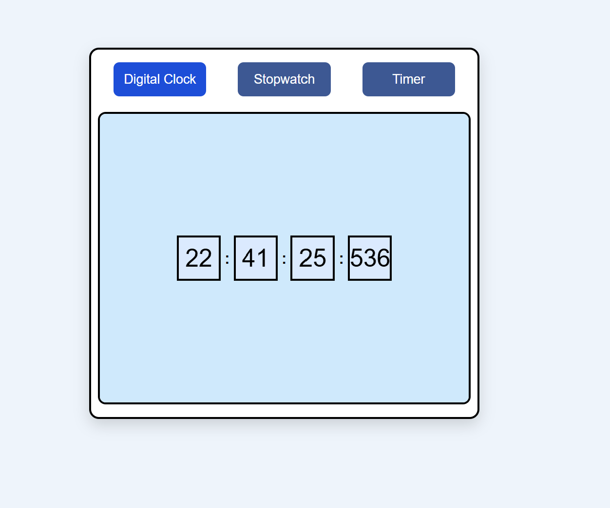
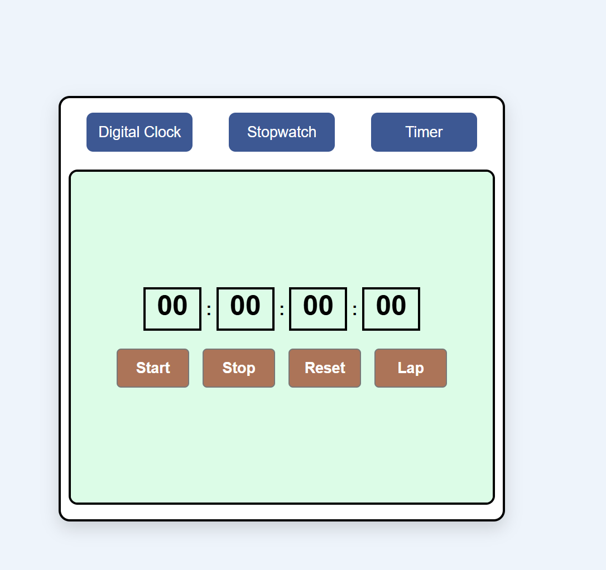
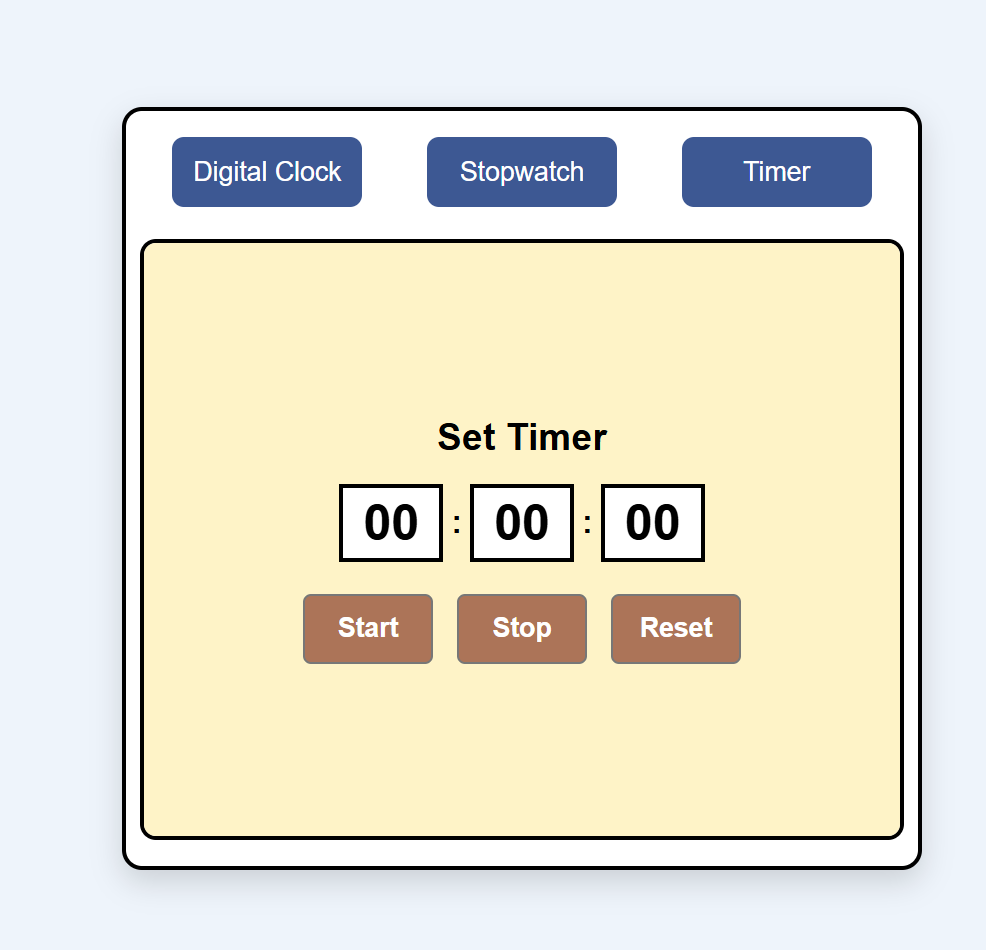

# Digital Clock + Stopwatch + Countdown Timer

## Overview

Digital Clock + Stopwatch + Countdown Timer is a responsive web application built using **HTML, CSS, and JavaScript**. It combines three essential time utilities into a single interface, allowing users to switch between them seamlessly.

The project was created to strengthen JavaScript fundamentals by implementing real-time updates, timers, DOM manipulation, dynamic element creation, and event handling without using any external libraries.

---

## Features

### Digital Clock
- Displays the current system time.
- Updates automatically in real time.
- Shows Hours, Minutes, Seconds, and Milliseconds.
- Uses leading zeros for better readability.

### Stopwatch
- Start the stopwatch.
- Pause and Resume functionality.
- Reset the stopwatch.
- Record unlimited lap times.
- Latest lap appears at the top.
- Delete individual lap records.
- Automatically hides the lap section when no laps exist.

### Countdown Timer
- User-defined Hours, Minutes, and Seconds.
- Start countdown.
- Pause and Resume countdown.
- Reset timer.
- Automatically stops when the timer reaches zero.

---

## Technologies Used

- HTML5
- CSS3
- JavaScript (ES6)
- DOM Manipulation
- Event Listeners
- setInterval()
- clearInterval()

---

## Project Structure

```text
DIGITAL CLOCK + STOPWATCH + TIMER
│
├── assets
│   ├── Digital_watch.png
│   ├── Stopwatch.png
│   └── Timer.png
│
├── Index.html
├── Index.css
├── Index.js
└── README.md
```

---

## Project Preview

### Digital Clock



---

### Stopwatch



---

### Countdown Timer



---

## How to Run

1. Clone the repository.

```bash
git clone https://github.com/your-username/your-repository-name.git
```

2. Open the project folder.

3. Open `Index.html` in your browser.

No installation or additional packages are required.

---

## JavaScript Concepts Practiced

- DOM Selection
- Event Handling
- Dynamic DOM Creation
- Functions
- Arrays
- Conditional Statements
- Timers
- setInterval()
- clearInterval()
- Date Object
- Template Literals
- String Formatting
- padStart()
- Dynamic UI Updates

---

## Future Improvements

- Sound notification when the timer finishes.
- Dark and Light mode.
- Store lap history using Local Storage.
- Keyboard shortcuts.
- Better stopwatch precision.
- Responsive improvements for smaller devices.
- Custom timer presets.

---

## Learning Outcomes

Through this project, I practiced:

- Building multiple JavaScript applications within one project.
- Managing multiple timers independently.
- Creating and removing DOM elements dynamically.
- Implementing pause and resume logic.
- Organizing JavaScript into reusable functions.
- Improving UI interaction using JavaScript.

---

## Author

**Aryan Chaubey**

GitHub: https://github.com/aryanchaubey243-sketch

---

## Live Demo


---

## License

This project is created for learning purposes and personal portfolio use.